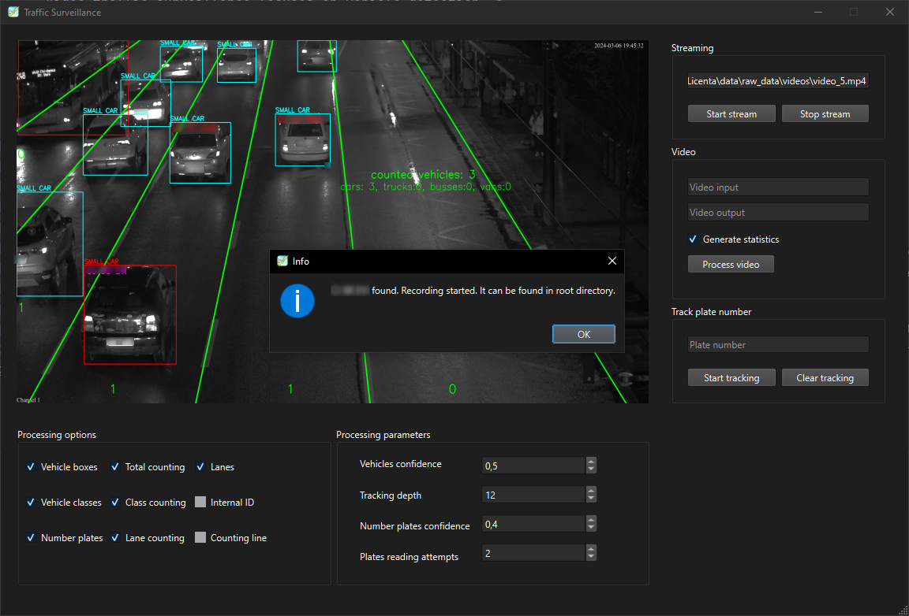

# Traffic Surveillance

Video traffic surveillance focuses on real-time vehicle detection, counting and 
classification to improve road 
safety and optimize traffic flow.

## Download

# Manual
All features are supported and designed for the traffic camera located at
Regionala CFR station, Cluj-Napoca. Features such as vehicle detection or plate 
number detection and tracking might work in similar setups.

## System requirements
Streaming/video processing speed relies on system requirements. The application
will respond much faster when run on a computer with GPU, CUDA and
a performant CPU, although these are not mandatory.

## How to use

### Streaming

Stream input can be either a URL of a video stream or a path to a video file for streaming simulation.

Multiple plate numbers can be added (one by one) and tracked. When tracked plate numbers are found,
 a notification will appear and a short recording of the video stream will start. Videos containing
tracked plate numbers will be stored in 'recordings' directory, parallel to the .exe file.

### Video

Video output field can be empty (defaulting to parallel to input video).

"Generate statistics" feature will create a .xlsx file in the output path containing
the following data: all found plate numbers, tracked and found plate numbers and 
all vehicles counting, including lane counting and type counting.

### Processing options:

"Number plates" option toggles plates detection and reading, significantly improving application speed when turned off. 
All other options mainly affect the drawing of the stream/video frames and have less impact on performance. 
Vehicles detection is always active even if vehicles boxes are not seen.

### Processing parameters:

Vehicles/number plates confidence: determines how accurate the detections and readings to be.

Tracking depth: number of frames the tracking algorithm uses. Useful for situations 
where stream/video is regularly interrupted and vehicles are not seen for a couple of frames. 

Plates reading attempts: number of plate number reading attempts assigned for each vehicle so unreadable vehicles are not processed over and over.
